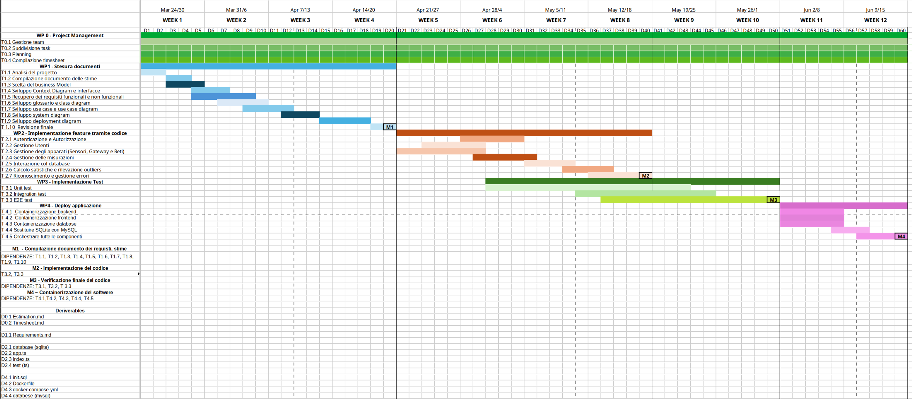

# Project Estimation

Date: 19/04/2025

Version: 1.0

# Estimation approach

Consideriamo il progetto Geocontrol come desritto nello swagger, si assume che il progetto sia sviluppato da zero senza classi già fornite. 

# Estimate by size

###

|                                                                                                         | Estimate |
| ------------------------------------------------------------------------------------------------------- | -------- |
| NC = Estimated number of classes to be developed                                                        |  20      |
| A = Estimated average size per class, in LOC                                                            |  110     |
| S = Estimated size of project, in LOC (= NC \* A)                                                       |   2220   |
| E = Estimated effort, in person hours (here use productivity 10 LOC per person hour)                    |  222     |
| C = Estimated cost, in euro (here use 1 person hour cost = 30 euro)                                     |   6660   |
| Estimated calendar time, in calendar weeks (Assume team of 4 people, 8 hours per day, 5 days per week ) | 7 days    |

# Estimate by product decomposition

###

| component name       | Estimated effort (person hours) |
| -------------------- | ------------------------------- |
| requirement document |               30                |
| design document      |               20                |
| code                 |               80                |
| unit tests           |               20                |
| api tests            |               30                |
| management documents |               30                |
| total                |               210               |

# Estimate by activity decomposition

###

| Activity name       | Estimated effort (person hours) |
| -------------       | ------------------------------- |
| project management  |               30                |
| stesura documenti   |               50                |
| implementazione feature tramite codice   |             80                  |
| implementazione test   |               55                |
| deploy applicazione   |               15                |
| total   |              230                 |

###

# Summary

|                                    | Estimated effort | Estimated duration |
| ---------------------------------- | ---------------- | ------------------ |
| estimate by size                   |      222         |       ≈ 7 days     |
| estimate by product decomposition  |      210         |       ≈ 7 days     |
| estimate by activity decomposition |      230         |       ≈ 8 days     |

Le differenze sono dovute all'approccio che si è tenuto nello stimare la durata del lavoro da svolgere. Nella prima stima si è partiti dal numero di classi che si pensa di sviluppare, si è fatta una media delle LOC necessarie per implementarne una (tenendo in considerazione la diversa complessità delle diverse classi) e si è infine tradotto in person hour considerando una produttività di 10 LOC per ph. In questa stima non si considera direttamente il tempo impiegato nella gestione e nella scrittura dei vari documenti (nonché dei test), relegando la loro considerazione a 2 soli indici, le linee di codice per person hour e le linee di codice per classe. Variando anche solo leggermente questi due indici è infatti possibile influenzare singificativamente la stima.  
Il secondo approccio, che sfrutta la decomposizione per prodotto, riporta un risultato abbastanza simile il che è positivo perché suggerisce l'attendibilità della stime. Questo approccio pone particolare attenzione anche alle altre fasi del progetto, ma rimane abbastanza generico sul tempo necessario a produrre il codice.   Nell'ultimo approccio sono state considerate le activity relative al containerizzazione del softwere che nelle altre non erano state prese in considerazione, è per questo motivo che le stime differiscono moderatamente.   In conclusione è possibile osservare che le stime sono confrontabili e quindi è lecito ritenerle sensate.
