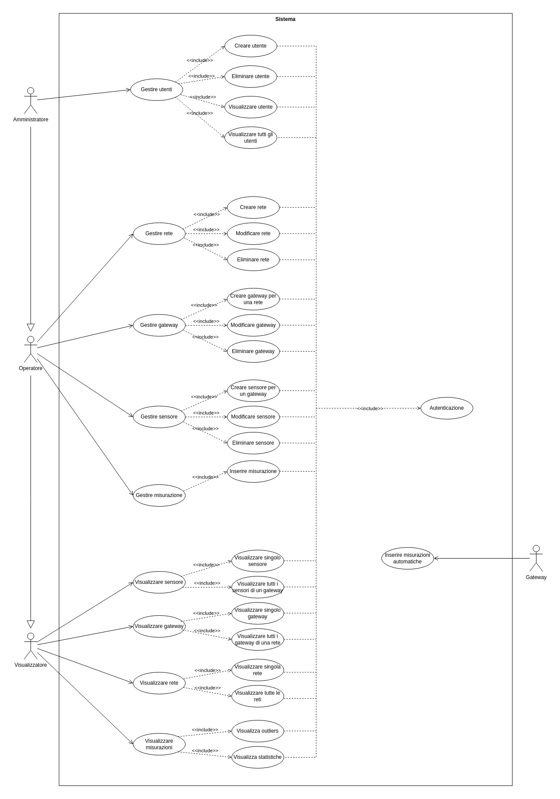

# Requirements Document - GeoControl

Date:

Version: V1 - description of Geocontrol as described in the swagger

| Version number | Change |
| :------------: | :----: |
|                |        |

## Contents

- [Requirements Document - GeoControl](#requirements-document---geocontrol)
  - [Contents](#contents)
- [Informal description](#informal-description)
- [Business Model](#business-model)
- [Stakeholders](#stakeholders)
- [Context Diagram and interfaces](#context-diagram-and-interfaces)
  - [Context Diagram](#context-diagram)
  - [Interfaces](#interfaces)
- [Stories and personas](#stories-and-personas)
      - [case 1.](#case-1)
      - [case 2.](#case-2)
      - [case 3.](#case-3)
- [Functional and non functional requirements](#functional-and-non-functional-requirements)
  - [Functional Requirements](#functional-requirements)
  - [Non Functional Requirements](#non-functional-requirements)
- [Use case diagram and use cases](#use-case-diagram-and-use-cases)
  - [Use case diagram](#use-case-diagram)
- [Use Cases and Scenarios](#use-cases-and-scenarios)
  - [Use Case 1 – Autenticazione](#use-case-1--autenticazione)
    - [Scenario 1.1 – Autenticazione valida](#scenario-11--autenticazione-valida)
    - [Scenario 1.2 – Autenticazione fallita](#scenario-12--autenticazione-fallita)
  - [Use Case 2 – Creazione Utente](#use-case-2--creazione-utente)
    - [Scenario 2.1 – Creazione utente con successo](#scenario-21--creazione-utente-con-successo)
    - [Scenario 2.2 – Creazione utente fallita](#scenario-22--creazione-utente-fallita)
  - [Use Case 3 – Eliminazione Utente](#use-case-3--eliminazione-utente)
    - [Scenario 3.1 – Eliminazione utente con successo](#scenario-31--eliminazione-utente-con-successo)
    - [Scenario 3.2 – Eliminazione utente fallita](#scenario-32--eliminazione-utente-fallita)
  - [Use Case 4 – Visualizzare Lista Utenti](#use-case-4--visualizzare-lista-utenti)
    - [Scenario 4.1 – Lista utenti con successo](#scenario-41--lista-utenti-con-successo)
    - [Scenario 4.2 – Errore nel recupero della lista](#scenario-42--errore-nel-recupero-della-lista)
  - [Use Case 5 – Visualizzare Dettaglio Utente](#use-case-5--visualizzare-dettaglio-utente)
    - [Scenario 5.1 – Visualizzazione dettaglio utente con successo](#scenario-51--visualizzazione-dettaglio-utente-con-successo)
    - [Scenario 5.2 – Errore di lettura dettaglio utente](#scenario-52--errore-di-lettura-dettaglio-utente)
  - [Use Case 6 – Creare Rete](#use-case-6--creare-rete)
    - [Scenario 6.1 – Creazione rete con successo](#scenario-61--creazione-rete-con-successo)
    - [Scenario 6.2 – Creazione rete fallita](#scenario-62--creazione-rete-fallita)
  - [Use Case 7 – Modificare Rete](#use-case-7--modificare-rete)
    - [Scenario 7.1 – Modifica rete con successo](#scenario-71--modifica-rete-con-successo)
    - [Scenario 7.2 – Modifica rete fallita](#scenario-72--modifica-rete-fallita)
  - [Use Case 8 – Eliminare Rete](#use-case-8--eliminare-rete)
    - [Scenario 8.1 – Eliminazione rete con successo](#scenario-81--eliminazione-rete-con-successo)
    - [Scenario 8.2 – Eliminazione rete fallita](#scenario-82--eliminazione-rete-fallita)
  - [Use Case 9 – Visualizzare Lista Reti](#use-case-9--visualizzare-lista-reti)
    - [Scenario 9.1 – Visualizzazione lista reti con successo](#scenario-91--visualizzazione-lista-reti-con-successo)
    - [Scenario 9.2 – Errore nella visualizzazione lista reti](#scenario-92--errore-nella-visualizzazione-lista-reti)
  - [Use Case 10 – Visualizzare Dettaglio Rete](#use-case-10--visualizzare-dettaglio-rete)
    - [Scenario 10.1 – Visualizzare dettaglio rete con successo](#scenario-101--visualizzare-dettaglio-rete-con-successo)
    - [Scenario 10.2 – Errore visualizzazione dettaglio rete](#scenario-102--errore-visualizzazione-dettaglio-rete)
  - [Use Case 11 – Creare Gateway](#use-case-11--creare-gateway)
    - [Scenario 11.1 – Creazione gateway con successo](#scenario-111--creazione-gateway-con-successo)
    - [Scenario 11.2 – Creazione gateway fallita](#scenario-112--creazione-gateway-fallita)
  - [Use Case 12 – Modificare Gateway](#use-case-12--modificare-gateway)
    - [Scenario 12.1 – Modifica gateway con successo](#scenario-121--modifica-gateway-con-successo)
    - [Scenario 12.2 – Modifica gateway fallita](#scenario-122--modifica-gateway-fallita)
  - [Use Case 13 – Eliminare Gateway](#use-case-13--eliminare-gateway)
    - [Scenario 13.1 – Eliminazione gateway con successo](#scenario-131--eliminazione-gateway-con-successo)
    - [Scenario 13.2 – Eliminazione gateway fallita](#scenario-132--eliminazione-gateway-fallita)
  - [Use Case 14 – Visualizzare Lista Gateway](#use-case-14--visualizzare-lista-gateway)
    - [Scenario 14.1 – Visualizzazione lista gateway con successo](#scenario-141--visualizzazione-lista-gateway-con-successo)
    - [Scenario 14.2 – Errore visualizzazione lista gateway](#scenario-142--errore-visualizzazione-lista-gateway)
  - [Use Case 15 – Visualizzare Dettaglio Gateway](#use-case-15--visualizzare-dettaglio-gateway)
    - [Scenario 15.1 – Visualizzazione dettaglio gateway con successo](#scenario-151--visualizzazione-dettaglio-gateway-con-successo)
    - [Scenario 15.2 – Errore visualizzazione dettaglio gateway](#scenario-152--errore-visualizzazione-dettaglio-gateway)
  - [Use Case 16 – Creare Sensore](#use-case-16--creare-sensore)
    - [Scenario 16.1 – Creazione sensore con successo](#scenario-161--creazione-sensore-con-successo)
    - [Scenario 16.2 – Creazione sensore fallita](#scenario-162--creazione-sensore-fallita)
  - [Use Case 17 – Modificare Sensore](#use-case-17--modificare-sensore)
    - [Scenario 17.1 – Modifica sensore con successo](#scenario-171--modifica-sensore-con-successo)
    - [Scenario 17.2 – Modifica sensore fallita](#scenario-172--modifica-sensore-fallita)
  - [Use Case 18 – Eliminare Sensore](#use-case-18--eliminare-sensore)
    - [Scenario 18.1 – Eliminazione sensore con successo](#scenario-181--eliminazione-sensore-con-successo)
    - [Scenario 18.2 – Eliminazione sensore fallita](#scenario-182--eliminazione-sensore-fallita)
  - [Use Case 19 – Visualizzare Lista Sensori](#use-case-19--visualizzare-lista-sensori)
    - [Scenario 19.1 – Visualizzazione lista sensori con successo](#scenario-191--visualizzazione-lista-sensori-con-successo)
    - [Scenario 19.2 – Errore visualizzazione lista sensori](#scenario-192--errore-visualizzazione-lista-sensori)
  - [Use Case 20 – Visualizzare Dettaglio Sensore](#use-case-20--visualizzare-dettaglio-sensore)
    - [Scenario 20.1 – Visualizzazione dettaglio sensore con successo](#scenario-201--visualizzazione-dettaglio-sensore-con-successo)
    - [Scenario 20.2 – Errore visualizzazione dettaglio sensore](#scenario-202--errore-visualizzazione-dettaglio-sensore)
  - [Use Case 21 – Inserire Misurazioni](#use-case-21--inserire-misurazioni)
    - [Scenario 21.1 – Inserimento misurazioni con successo](#scenario-211--inserimento-misurazioni-con-successo)
    - [Scenario 21.2 – Inserimento misurazioni fallito](#scenario-212--inserimento-misurazioni-fallito)
  - [Use Case 22 – Invio Misurazioni automatico](#use-case-22--invio-misurazioni-automatico)
    - [Scenario 22.1 – Invio misurazioni con successo](#scenario-221--invio-misurazioni-con-successo)
    - [Scenario 22.2 – Invio misurazioni fallito](#scenario-222--invio-misurazioni-fallito)
  - [Use Case 23 – Visualizzare Misurazioni](#use-case-23--visualizzare-misurazioni)
    - [Scenario 23.1 – Visualizzazione misurazioni](#scenario-231--visualizzazione-misurazioni)
    - [Scenario 23.2 – Nessuna misurazione presente](#scenario-232--nessuna-misurazione-presente)
  - [Use Case 24 – Visualizzare Statistiche](#use-case-24--visualizzare-statistiche)
    - [Scenario 24.1 – Visualizzazione statistiche](#scenario-241--visualizzazione-statistiche)
    - [Scenario 24.2 – Nessuna statistica disponibile](#scenario-242--nessuna-statistica-disponibile)
  - [Use Case 25 – Visualizzare Anomalie (Outliers)](#use-case-25--visualizzare-anomalie-outliers)
    - [Scenario 25.1 – Visualizzazione anomalie con successo](#scenario-251--visualizzazione-anomalie-con-successo)
    - [Scenario 25.2 – Nessuna anomalia disponibile](#scenario-252--nessuna-anomalia-disponibile)
  - [| **Passo 4**         | Il sistema non trova alcuna anomalia corrispondente e mostra un messaggio di avviso |](#-passo-4----------il-sistema-non-trova-alcuna-anomalia-corrispondente-e-mostra-un-messaggio-di-avviso-)
- [Glossary](#glossary)
- [System Design](#system-design)
- [Deployment Diagram](#deployment-diagram)

---

# Informal description

GeoControl è un sistema software progettato per monitorare variabili fisiche e ambientali in diversi contesti: dalle analisi idrogeologiche di aree montane alla sorveglianza di edifici storici, fino al controllo di parametri interni (come temperatura o illuminazione) in ambienti residenziali o lavorativi.

---

# Business Model

Geo Control è una piattaforma commissionata dall'Unione delle Comunità Montane della Regione Piemonte, finalizzata alla gestione e al monitoraggio dello stato idrogeologico del territorio.  

I diritti di proprietà intellettuale sul software restano in capo all’azienda sviluppatrice, la quale detiene piena facoltà di sfruttamento commerciale del prodotto.  

Grazie alla sua architettura modulare, il software è predisposto per la distribuzione su scala più ampia, potendo essere proposto sul mercato a enti pubblici e privati che necessitano di un monitoraggio continuativo dei parametri fisici relativi alle proprie aree di competenza.  

L’accesso a Geo Control avviene tramite la sottoscrizione di contratti di licenza a durata determinata, con un costo variabile in funzione della durata del contratto stesso della dimensione delle aree da monitorare. Durante il periodo di validità contrattuale, sono garantiti il supporto tecnico, l’assistenza dedicata e l’aggiornamento costante sia del software sia dell’interfaccia utente.  

Il contratto non può essere interrotto anticipatamente se non previo pagamento di una penale. Alla scadenza, l’acquirente ha facoltà di rinnovare e/o ricontrattare il contratto o di cessarne l’utilizzo.  

Tutta l’infrastruttura fisica e tecnica, comprensiva di gateway, reti e sensori, è gestita da soggetti terzi.  

Geo Control si occupa esclusivamente della gestione, archiviazione e consultazione dei dati trasmessi da tali dispositivi. 

---
# Stakeholders

| Stakeholder | Descrizione |
| :--------------: | :---------: |
|Ente pubblico/privato| Acquisto del servizio|
| Visualizzatore | Consultazione dei dati|
| Operatore |  Gestione di reti, gateway e sensori e inserimento misurazioni  |
| Amministratore |  Accesso completo a tutte le risorse (gestione degli utenti e della rete)    |
| Tecnico esterno |   Installazione, manutenzione e rimozione in loco di sensori e gateway    |
| Tecnico di sistema | Manutenzione e aggiornamento del sistema  |

# Context Diagram and interfaces

## Context Diagram

## Interfaces

|   Attore   | Interfaccia logica | Interfaccia fisica |
| :-------: | :---------------: | :----------------: |
| Rete |  Connessione internet (via API)  |  API per inviare le misurazioni in formato JSON     |
|  Utente  | PC | GUI |
|  Operatore  | PC | GUI |
|  Admin  | PC | GUI + console di comando |

# Stories and personas

#### case 1.
L'organizzazione privata che possiede una residenza storica sul lago di Como è interessata a monitorare parametri quali umidità e temperatura degli ambienti per mantenere in buono stato le opere d'arte e gli affrischi all'interno.  
Si rivolge a questo sistema che gli ermettera di avere accesso ai dati di tutta l'abitaizone e quindi intervenire nel caso i parametri non siano soddisfacenti 

#### case 2.
L'azienda che gestisce un tratto autostradale è interessata a monitorare le condizioni di una parete rocciosa instabile che potrebbe subire distacchi di detriti e mettere quindi in pericolo la circolazione.   E' alla ricerca quindi di un sistema come il nostro che garantisce scalabilità e un'alto standard di reliability (max 3 misurazioni all'anno per sensore perse).

#### case 3.
Un piccolo comune siciliano è interessato al sistema che vorrebbe usare per monitorare lo stato di un edificio storico al centro del loro paese per il rischio di assestamenti naturali del terreno argilloso che potrebbero compromettere alla lunga le fondamenta dell'edificio.  
Sono attratti in particolare dal fatto che il sistema è stato sviluppato su commisisone di un ente pubblico e rispetta le caratteristiche che un ente come il loro cerca.

# Functional and non functional requirements

## Functional Requirements

|  ID   | Description |
| :---: | :---------: |
|  FR1  | Autenticazione e autorizzazione con token univoco |
|||
|  FR2  | Gestione utenti|
| 2.1 | Creazione nuovo utente |
| 2.2 | Eliminazione di un utente |
| 2.3 | Visualizzazione della lista degli utenti |
| 2.4 | Visualizzazione di uno specifico utente |
|||
|  FR3  | Gestione delle reti|
| 3.1 | Creazione di una nuova rete |
| 3.2 | Aggiornamento di una rete esistente |
| 3.3 | Eliminazione di una rete |
| 3.4 | Visualizzazione di una rete specifica |
| 3.5 | Visualizzazione di tutte le reti |
|||
|  FR4  | Gestione dei gateway|
| 4.1 | Creazione di un nuovo gateway nella rete |
| 4.2 | Aggiornamento di un gateway esistente |
| 4.3 | Eliminazione di un gateway esistente |
| 4.4 | Visualizzazione di tutti i gateway di una rete |
| 4.5 | Visualizzazione di uno specifico gateway |
|||
|  FR5  | Gestione dei sensori |
| 5.1 | Creazione di un nuovo sensore |
| 5.2 | Aggiornamento di un sensore esistente |
| 5.3 | Eliminazione di un sensore esistente |
| 5.4 | Visualizzazione di tutti i sensori di un gateway |
| 5.5 | Visualizzazione di uno specifico sensore |
|||
|  FR6  | Gestione delle misurazioni |
| 6.1 | Archiviazione delle misurazioni di un sensore |
| 6.2 | Gestione dei timestamp |
| 6.2.1 | Conversione in formato ISO 8601 con riferimento UTC |
| 6.2.2 | Conversione in fuso orario locale per la visualizzazione dei dati |
| 6.3 | Visualizzazione delle misurazioni di un set di sensori di una rete |
| 6.4 | Visualizzazione delle misurazioni di uno specifico sensore |
|||
|  FR7  | Gestione delle statistiche |
| 7.1 | Calcolo delle media |
| 7.2 | Calcolo della varianza |
| 7.3 | Calcolo delle soglie |
| 7.4 | Identificazione di anomalie secondo soglie |
| 7.5 | Visualizzazione delle statistiche di un set di sensori di una specifica rete |
| 7.6 | Visualizzazione delle anomalie di un set di sensori di una specifica rete |
| 7.7 | Visualizzazione delle statistiche di un sensore |
| 7.8 | Visualizzazione delle anomalie di un sensore |
|||
| FR 8 | Sistema di log per gestione degli errori |

## Non Functional Requirements

\<Describe constraints on functional requirements>

|   ID    | Tipo | Descrizione | Riferito a |
| :-----: | :--------------------------------: | :---------: | :-------: |
|  NFR1   |    dominio  | timestamp in formato ISO 8601 |   FR 6.2    |
|  NFR2   |        dominio       | unità di misura del SI |   FR 6  |
|  NFR3   |        dominio       | gli elementi del sistema sono identificati univocamente| FR 3, FR 4, FR 5    |
|  NFR4   |        affidabilità   | il sistema non deve perdere più di 6 misurazioni all'anno (per sensore)|    FR6    |
|  NFR5   | usabilità | l'utente 'visualizzatore' non deve avere bisogno di training |    FR 2    |
|  NFR6   | usabilità | un utente 'operatore' deve imparare a usare il software in meno di 4 ore di training |   FR 2     |
|  NFR7   | usabilità | un utente 'amministratore' deve imparare a usare il software in meno di 8 ore di training |   FR 2     |
|  NFR8   |  sicurezza      | protenzione da accessi esterni non autorizzati | FR1 |
|  NFR9  |  portabilità     | L’applicazione web deve essere disponibile sui seguenti browser: • Chrome (da versione ...) • Firefox (da versione ...) • Safari • Opera| Tutti  |

# Use case diagram and use cases

## Use case diagram

# Use Cases and Scenarios

## Use Case 1 – Autenticazione

| **Attori Coinvolti** | utente, sistema                                                 |
|:--------------------:|:--------------------------------------------------------------: |
| **Precondizione**    | nessun utente risulta autenticato su questa postazione          |
| **Postcondizione**   | l’utente è autenticato; il sistema ha generato un token valido  |
| **Scenario Nominale** | [Scenario 1.1 – Autenticazione valida](#scenario-11--autenticazione-valida) |
| **Eccezioni**        | [Scenario 1.2 – Autenticazione fallita](#scenario-12--autenticazione-fallita) |

### Scenario 1.1 – Autenticazione valida

| Scenario 1.1       | Autenticazione valida                                             |
|:------------------:|:-----------------------------------------------------------------:|
| **Precondizione**  | nessun utente è autenticato                                      |
| **Postcondizione** | l’utente è autenticato, viene generato il token                  |
| **Passi**          |                                                                   |
| **Passo 1**        | L’utente richiede di loggarsi                                     |
| **Passo 2**        | Il sistema fornisce il form di login (username/password)          |
| **Passo 3**        | L’utente compila il form correttamente                            |
| **Passo 4**        | Il sistema genera il token e autentica l’utente                   |

### Scenario 1.2 – Autenticazione fallita

| Scenario 1.2       | Autenticazione fallita                                              |
|:------------------:|:-------------------------------------------------------------------:|
| **Precondizione**  | nessun utente è autenticato                                        |
| **Postcondizione** | nessun utente risulta autenticato, il form resta vuoto             |
| **Passi**          |                                                                     |
| **Passo 1**        | L’utente richiede di loggarsi                                      |
| **Passo 2**        | Il sistema fornisce il form di login                               |
| **Passo 3**        | L’utente inserisce credenziali errate                              |
| **Passo 4**        | Il sistema avvisa dell’errore                                      |
| **Passo 5**        | Il sistema ripresenta il form di login (vuoto)                     |

---

## Use Case 2 – Creazione Utente

| **Attori Coinvolti** | Utente Amministratore, Sistema                                          |
|:--------------------:|:----------------------------------------------------------------------: |
| **Precondizione**    | L’Utente Amministratore è autenticato                                   |
| **Postcondizione**   | un nuovo utente risulta creato nel sistema                              |
| **Scenario Nominale** | [Scenario 2.1 – Creazione utente con successo](#scenario-21--creazione-utente-con-successo) |
| **Eccezioni**        | [Scenario 2.2 – Creazione utente fallita](#scenario-22--creazione-utente-fallita) |

### Scenario 2.1 – Creazione utente con successo

| Scenario 2.1       | Creazione utente con successo                                       |
|:------------------:|:-------------------------------------------------------------------:|
| **Precondizione**  | utente amministratore autenticato                                   |
| **Postcondizione** | il nuovo utente è registrato nel sistema                            |
| **Passi**          |                                                                     |
| **Passo 1**        | L’utente amministratore richiede di creare un nuovo utente          |
| **Passo 2**        | Il sistema presenta un form con username, password, ruolo           |
| **Passo 3**        | L’utente amministratore compila correttamente il form               |
| **Passo 4**        | Il sistema valida i dati immessi                                    |
| **Passo 5**        | Il sistema registra il nuovo utente                                 |
| **Passo 6**        | Il sistema conferma l’avvenuta creazione                            |

### Scenario 2.2 – Creazione utente fallita

| Scenario 2.2       | Creazione utente fallita                                           |
|:------------------:|:------------------------------------------------------------------:|
| **Precondizione**  | utente amministratore autenticato                                  |
| **Postcondizione** | nessun nuovo utente è creato, il sistema è invariato              |
| **Passi**          |                                                                    |
| **Passo 1**        | L’utente amministratore richiede di creare un nuovo utente         |
| **Passo 2**        | Il sistema presenta il form (username, password, ruolo)            |
| **Passo 3**        | L’utente amministratore compila in modo errato o con dati duplicati|
| **Passo 4**        | Il sistema rileva l’errore                                        |
| **Passo 5**        | Il sistema notifica l’errore e chiede di reinserire i dati        |
| **Passo 6**        | Il sistema ripresenta il form con eventuali campi da correggere   |

---

## Use Case 3 – Eliminazione Utente

(*Corrisponde al precedente UC4, rietichettato come UC3.*)

| **Attori Coinvolti** | Utente Amministratore, Sistema                                              |
|:--------------------:|:--------------------------------------------------------------------------: |
| **Precondizione**    | utente amministratore autenticato; l’utente target compare nella lista utenti |
| **Postcondizione**   | l’utente selezionato risulta eliminato                                     |
| **Scenario Nominale** | [Scenario 3.1 – Eliminazione utente con successo](#scenario-31--eliminazione-utente-con-successo) |
| **Eccezioni**        | [Scenario 3.2 – Eliminazione utente fallita](#scenario-32--eliminazione-utente-fallita) |

### Scenario 3.1 – Eliminazione utente con successo

| Scenario 3.1       | Eliminazione utente con successo                                   |
|:------------------:|:------------------------------------------------------------------:|
| **Precondizione**  | utente amministratore autenticato, l’utente target compare nella lista utenti |
| **Postcondizione** | l’utente selezionato è rimosso dal sistema                        |
| **Passi**          |                                                                    |
| **Passo 1**        | L’utente amministratore richiede di eliminare un utente           |
| **Passo 2**        | Il sistema chiede conferma dell’eliminazione                      |
| **Passo 3**        | L’utente amministratore conferma l’operazione                     |
| **Passo 4**        | Il sistema elimina l’utente e notifica l’esito positivo           |

### Scenario 3.2 – Eliminazione utente fallita

| Scenario 3.2       | Eliminazione utente fallita                                             |
|:------------------:|:----------------------------------------------------------------------:|
| **Precondizione**  | utente amministratore autenticato, l’utente target è visibile nella lista utenti |
| **Postcondizione** | l’utente non viene rimosso, appare un messaggio d’errore               |
| **Passi**          |                                                                         |
| **Passo 1**        | L’utente amministratore richiede di eliminare un utente                 |
| **Passo 2**        | Il sistema chiede conferma                                              |
| **Passo 3**        | L’utente amministratore conferma l’operazione                           |
| **Passo 4**        | Il sistema non può eliminare l’utente (es. è l’unico utente amministratore)  |
| **Passo 5**        | Il sistema mostra un messaggio d’errore e annulla l’operazione         |

---

## Use Case 4 – Visualizzare Lista Utenti

(*Corrisponde al precedente UC5, rietichettato come UC4.*)

| **Attori Coinvolti** | Utente Amministratore, Sistema                                 |
|:--------------------:|:-------------------------------------------------------------: |
| **Precondizione**    | utente amministratore autenticato                             |
| **Postcondizione**   | viene mostrata la lista degli utenti                          |
| **Scenario Nominale** | [Scenario 4.1 – Lista utenti con successo](#scenario-41--lista-utenti-con-successo) |
| **Eccezioni**        | [Scenario 4.2 – Errore nel recupero della lista](#scenario-42--errore-nel-recupero-della-lista) |

### Scenario 4.1 – Lista utenti con successo

| Scenario 4.1       | Lista utenti mostrata con successo                    |
|:------------------:|:-----------------------------------------------------:|
| **Precondizione**  | utente amministratore autenticato                     |
| **Postcondizione** | la lista di tutti gli utenti è visibile               |
| **Passi**          |                                                       |
| **Passo 1**        | L’utente amministratore richiede l'elenco degli utenti|
| **Passo 2**        | Il sistema visualizza la lista                        |

### Scenario 4.2 – Errore nel recupero della lista

| Scenario 4.2       | Errore nel recupero della lista utenti                  |
|:------------------:|:-------------------------------------------------------:|
| **Precondizione**  | utente amministratore autenticato                      |
| **Postcondizione** | la lista non viene mostrata, appare un messaggio d’errore |
| **Passi**          |                                                        |
| **Passo 1**        | L’utente amministratore richiede la lista utenti       |
| **Passo 2**        | Un problema impedisce la lettura                       |
| **Passo 3**        | Il sistema mostra un errore                            |

---

## Use Case 5 – Visualizzare Dettaglio Utente

(*Corrisponde al precedente UC6, rietichettato come UC5.*)

| **Attori Coinvolti** | Utente Amministratore, Sistema                                            |
|:--------------------:|:------------------------------------------------------------------------: |
| **Precondizione**    | utente amministratore autenticato; l’utente target esiste                 |
| **Postcondizione**   | vengono mostrati i dettagli dell’utente selezionato                      |
| **Scenario Nominale** | [Scenario 5.1 – Visualizzazione dettaglio utente con successo](#scenario-51--visualizzazione-dettaglio-utente-con-successo) |
| **Eccezioni**        | [Scenario 5.2 – Errore di lettura dettaglio utente](#scenario-52--errore-di-lettura-dettaglio-utente) |

### Scenario 5.1 – Visualizzazione dettaglio utente con successo

| Scenario 5.1       | Visualizzazione dettaglio utente con successo              |
|:------------------:|:----------------------------------------------------------:|
| **Precondizione**  | utente amministratore autenticato, l’utente target esiste  |
| **Postcondizione** | vengono mostrati i dettagli dell’utente selezionato        |
| **Passi**          |                                                            |
| **Passo 1**        | L’utente amministratore seleziona l’utente                 |
| **Passo 2**        | Il sistema visualizza i dettagli dell’utente richiesto     |

### Scenario 5.2 – Errore di lettura dettaglio utente

| Scenario 5.2       | Errore di lettura dettaglio utente                         |
|:------------------:|:----------------------------------------------------------:|
| **Precondizione**  | utente amministratore autenticato                          |
| **Postcondizione** | il sistema non mostra alcun dettaglio, viene segnalato l’errore |
| **Passi**          |                                                            |
| **Passo 1**        | L’utente amministratore seleziona l’utente da visualizzare |
| **Passo 2**        | I dati non sono disponibili                                |
| **Passo 3**        | Il sistema mostra un errore                                |

---

## Use Case 6 – Creare Rete

(*Corrisponde al precedente UC7, rietichettato come UC6.*)

| **Attori Coinvolti** | utente amministratore o operatore, Sistema            |
|:--------------------:|:----------------------------------------------------: |
| **Precondizione**    | l’utente amministratore o operatore è autenticato     |
| **Postcondizione**   | una nuova rete risulta inserita                       |
| **Scenario Nominale** | [Scenario 6.1 – Creazione rete con successo](#scenario-61--creazione-rete-con-successo) |
| **Eccezioni**        | [Scenario 6.2 – Creazione rete fallita](#scenario-62--creazione-rete-fallita) |

### Scenario 6.1 – Creazione rete con successo

| Scenario 6.1       | Creazione rete con successo                                 |
|:------------------:|:-----------------------------------------------------------:|
| **Precondizione**  | l’utente amministratore o operatore è autenticato          |
| **Postcondizione** | una nuova rete risulta inserita                            |
| **Passi**          |                                                             |
| **Passo 1**        | L’utente richiede la creazione di una nuova rete           |
| **Passo 2**        | Il sistema presenta un form con i campi necessari          |
| **Passo 3**        | L’utente compila correttamente il form                     |
| **Passo 4**        | Il sistema valida i dati                                    |
| **Passo 5**        | Il sistema inserisce la rete                                |
| **Passo 6**        | Il sistema notifica l’esito positivo                        |

### Scenario 6.2 – Creazione rete fallita

| Scenario 6.2       | Creazione rete fallita                                      |
|:------------------:|:-----------------------------------------------------------:|
| **Precondizione**  | l’utente amministratore o operatore è autenticato           |
| **Postcondizione** | nessuna nuova rete risulta creata                           |
| **Passi**          |                                                             |
| **Passo 1**        | L’utente richiede creazione rete                            |
| **Passo 2**        | Il sistema presenta un form con i campi necessari           |
| **Passo 3**        | L’utente compila in modo errato                             |
| **Passo 4**        | Il sistema rileva l’errore e lo notifica                    |
| **Passo 5**        | Il sistema chiede di correggere i dati                      |

---

## Use Case 7 – Modificare Rete

(*Corrisponde al precedente UC8, rietichettato come UC7.*)

| **Attori Coinvolti** | utente amministratore o operatore, Sistema                   |
|:--------------------:|:-----------------------------------------------------------: |
| **Precondizione**    | l’utente amministratore o operatore è autenticato; la rete target esiste  |
| **Postcondizione**   | la rete risulta modificata nei campi desiderati             |
| **Scenario Nominale** | [Scenario 7.1 – Modifica rete con successo](#scenario-71--modifica-rete-con-successo) |
| **Eccezioni**        | [Scenario 7.2 – Modifica rete fallita](#scenario-72--modifica-rete-fallita) |

### Scenario 7.1 – Modifica rete con successo

| Scenario 7.1       | Modifica rete con successo                                   |
|:------------------:|:------------------------------------------------------------:|
| **Precondizione**  | l’utente amministratore o operatore è autenticato; la rete target esiste |
| **Postcondizione** | la rete risulta modificata nei campi desiderati             |
| **Passi**          |                                                              |
| **Passo 1**        | L’utente richiede modifica di una rete                       |
| **Passo 2**        | Il sistema mostra i dati attuali                             |
| **Passo 3**        | L’utente modifica i campi desiderati                         |
| **Passo 4**        | Il sistema valida i nuovi dati                               |
| **Passo 5**        | Il sistema registra la modifica                              |
| **Passo 6**        | Il sistema conferma l’operazione                             |

### Scenario 7.2 – Modifica rete fallita

| Scenario 7.2       | Modifica rete fallita                                   |
|:------------------:|:-------------------------------------------------------:|
| **Precondizione**  | l’utente amministratore o operatore è autenticato; la rete target esiste |
| **Postcondizione** | la rete resta invariata; errore mostrato               |
| **Passi**          |                                                         |
| **Passo 1**        | L’utente richiede modifica rete                         |
| **Passo 2**        | L’utente inserisce dati invalidi                        |
| **Passo 3**        | Il sistema rileva l’errore                              |
| **Passo 4**        | Il sistema notifica l’errore e annulla la modifica      |

---

## Use Case 8 – Eliminare Rete

(*Corrisponde al precedente UC9, rietichettato come UC8.*)

| **Attori Coinvolti** | utente amministratore o operatore, Sistema            |
|:--------------------:|:-----------------------------------------------------:|
| **Precondizione**    | l’utente amministratore o operatore è autenticato; la rete target esiste |
| **Postcondizione**   | la rete selezionata risulta eliminata                 |
| **Scenario Nominale** | [Scenario 8.1 – Eliminazione rete con successo](#scenario-81--eliminazione-rete-con-successo) |
| **Eccezioni**        | [Scenario 8.2 – Eliminazione rete fallita](#scenario-82--eliminazione-rete-fallita) |

### Scenario 8.1 – Eliminazione rete con successo

| Scenario 8.1       | Eliminazione rete con successo                          |
|:------------------:|:-------------------------------------------------------:|
| **Precondizione**  | l’utente amministratore o operatore è autenticato; la rete target esiste |
| **Postcondizione** | la rete selezionata risulta eliminata                   |
| **Passi**          |                                                         |
| **Passo 1**        | L’utente richiede di eliminare una rete                 |
| **Passo 2**        | Il sistema chiede conferma                              |
| **Passo 3**        | L’utente conferma                                       |
| **Passo 4**        | Il sistema elimina la rete e notifica l’esito positivo  |

### Scenario 8.2 – Eliminazione rete fallita

| Scenario 8.2       | Eliminazione rete fallita                              |
|:------------------:|:------------------------------------------------------:|
| **Precondizione**  | l’utente amministratore o operatore è autenticato; la rete target esiste |
| **Postcondizione** | la rete resta nel sistema, appare un messaggio d’errore|
| **Passi**          |                                                        |
| **Passo 1**        | L’utente richiede di eliminare una rete                |
| **Passo 2**        | Il sistema chiede conferma                             |
| **Passo 3**        | L’utente conferma                                      |
| **Passo 4**        | Il sistema rileva un impedimento                       |
| **Passo 5**        | Il sistema mostra l’errore e annulla l’operazione      |

---

## Use Case 9 – Visualizzare Lista Reti

(*Corrisponde al precedente UC10, rietichettato come UC9.*)

| **Attori Coinvolti** | utente amministratore, Operatore, Visualizzatore, Sistema |
|:--------------------:|:---------------------------------------------------------:|
| **Precondizione**    | l’utente amministratore o operatore è autenticato         |
| **Postcondizione**   | appare la lista delle reti presenti nel sistema           |
| **Scenario Nominale** | [Scenario 9.1 – Visualizzazione lista reti con successo](#scenario-91--visualizzazione-lista-reti-con-successo) |
| **Eccezioni**        | [Scenario 9.2 – Errore nella visualizzazione lista reti](#scenario-92--errore-nella-visualizzazione-lista-reti) |

### Scenario 9.1 – Visualizzazione lista reti con successo

| Scenario 9.1       | Visualizzazione lista reti con successo                   |
|:------------------:|:---------------------------------------------------------:|
| **Precondizione**  | l’utente amministratore o operatore è autenticato         |
| **Postcondizione** | appare la lista delle reti presenti nel sistema           |
| **Passi**          |                                                           |
| **Passo 1**        | L’utente richiede la lista delle reti                     |
| **Passo 2**        | Il sistema mostra la lista                                |

### Scenario 9.2 – Errore nella visualizzazione lista reti

| Scenario 9.2       | Errore nella visualizzazione lista reti                  |
|:------------------:|:--------------------------------------------------------:|
| **Precondizione**  | l’utente amministratore o operatore è autenticato        |
| **Postcondizione** | la lista non viene mostrata; appare un messaggio d’errore|
| **Passi**          |                                                          |
| **Passo 1**        | L’utente richiede la lista delle reti                    |
| **Passo 2**        | Un problema impedisce la lettura                         |
| **Passo 3**        | Il sistema notifica l’errore                             |

---

## Use Case 10 – Visualizzare Dettaglio Rete

(*Corrisponde al precedente UC11, rietichettato come UC10.*)

| **Attori Coinvolti** | utente amministratore, Operatore, Visualizzatore, Sistema |
|:--------------------:|:---------------------------------------------------------:|
| **Precondizione**    | utente amministratore o operatore autenticato; rete esistente |
| **Postcondizione**   | i dettagli della rete selezionata sono mostrati          |
| **Scenario Nominale** | [Scenario 10.1 – Visualizzare dettaglio rete con successo](#scenario-101--visualizzare-dettaglio-rete-con-successo) |
| **Eccezioni**        | [Scenario 10.2 – Errore visualizzazione dettaglio rete](#scenario-102--errore-visualizzazione-dettaglio-rete) |

### Scenario 10.1 – Visualizzare dettaglio rete con successo

| Scenario 10.1       | Visualizzazione dettaglio rete con successo     |
|:-------------------:|:-----------------------------------------------:|
| **Precondizione**   | utente amministratore o operatore autenticato, rete esistente |
| **Postcondizione**  | il sistema mostra le info della rete            |
| **Passi**           |                                                 |
| **Passo 1**         | L’utente seleziona la rete desiderata           |
| **Passo 2**         | Il sistema mostra i dettagli                    |

### Scenario 10.2 – Errore visualizzazione dettaglio rete

| Scenario 10.2       | Errore visualizzazione dettaglio rete            |
|:-------------------:|:------------------------------------------------:|
| **Precondizione**   | utente amministratore o operatore autenticato    |
| **Postcondizione**  | nessuna informazione visualizzata, compare errore|
| **Passi**           |                                                  |
| **Passo 1**         | L’utente seleziona la rete                       |
| **Passo 2**         | Il sistema mostra un errore                      |

---

## Use Case 11 – Creare Gateway

(*Corrisponde al precedente UC12, rietichettato come UC11.*)

| **Attori Coinvolti** | utente amministratore o operatore, Sistema               |
|:--------------------:|:--------------------------------------------------------:|
| **Precondizione**    | utente amministratore o operatore autenticato; rete disponibile |
| **Postcondizione**   | un nuovo gateway è creato e associato alla rete         |
| **Scenario Nominale** | [Scenario 11.1 – Creazione gateway con successo](#scenario-111--creazione-gateway-con-successo) |
| **Eccezioni**        | [Scenario 11.2 – Creazione gateway fallita](#scenario-112--creazione-gateway-fallita) |

### Scenario 11.1 – Creazione gateway con successo

| Scenario 11.1       | Creazione gateway con successo                         |
|:-------------------:|:------------------------------------------------------:|
| **Precondizione**   | utente amministratore o operatore autenticato, rete disponibile |
| **Postcondizione**  | gateway inserito                                       |
| **Passi**           |                                                        |
| **Passo 1**         | L’utente richiede la creazione di un nuovo gateway     |
| **Passo 2**         | Il sistema presenta un form per i dati necessari       |
| **Passo 3**         | L’utente compila correttamente                         |
| **Passo 4**         | Il sistema valida i dati                               |
| **Passo 5**         | Il sistema registra il gateway                         |
| **Passo 6**         | Il sistema conferma l’esito                            |

### Scenario 11.2 – Creazione gateway fallita

| Scenario 11.2       | Creazione gateway fallita                               |
|:-------------------:|:-------------------------------------------------------:|
| **Precondizione**   | utente amministratore o operatore autenticato          |
| **Postcondizione**  | nessun gateway creato, compare un messaggio d’errore   |
| **Passi**           |                                                        |
| **Passo 1**         | L’utente richiede la creazione di un nuovo gateway     |
| **Passo 2**         | Il sistema presenta un form per i dati necessari       |
| **Passo 3**         | L’utente compila in modo errato                        |
| **Passo 4**         | Il sistema rileva l’errore                              |
| **Passo 5**         | Il sistema avvisa e annulla la creazione               |

---

## Use Case 12 – Modificare Gateway

(*Corrisponde al precedente UC13, rietichettato come UC12.*)

| **Attori Coinvolti** | utente amministratore o operatore, Sistema        |
|:--------------------:|:------------------------------------------------:|
| **Precondizione**    | utente amministratore o operatore autenticato; gateway esistente |
| **Postcondizione**   | il gateway è aggiornato                           |
| **Scenario Nominale** | [Scenario 12.1 – Modifica gateway con successo](#scenario-121--modifica-gateway-con-successo) |
| **Eccezioni**        | [Scenario 12.2 – Modifica gateway fallita](#scenario-122--modifica-gateway-fallita) |

### Scenario 12.1 – Modifica gateway con successo

| Scenario 12.1       | Modifica gateway con successo                      |
|:-------------------:|:--------------------------------------------------:|
| **Precondizione**   | utente amministratore o operatore autenticato, gateway esistente |
| **Postcondizione**  | i dati del gateway risultano aggiornati           |
| **Passi**           |                                                    |
| **Passo 1**         | L’utente richiede di modificare un gateway         |
| **Passo 2**         | Il sistema mostra i dati correnti                  |
| **Passo 3**         | L’utente modifica i campi desiderati               |
| **Passo 4**         | Il sistema valida i nuovi dati                     |
| **Passo 5**         | Il sistema registra la modifica                    |
| **Passo 6**         | Il sistema conferma l’avvenuto aggiornamento       |

### Scenario 12.2 – Modifica gateway fallita

| Scenario 12.2       | Modifica gateway fallita                                 |
|:-------------------:|:--------------------------------------------------------:|
| **Precondizione**   | utente amministratore o operatore autenticato           |
| **Postcondizione**  | il gateway resta invariato; errore segnalato            |
| **Passi**           |                                                          |
| **Passo 1**         | L’utente richiede di modificare un gateway              |
| **Passo 2**         | L’utente inserisce dati invalidi                         |
| **Passo 3**         | Il sistema rileva l’errore                              |
| **Passo 4**         | Il sistema avvisa e annulla la modifica                 |

---

## Use Case 13 – Eliminare Gateway

(*Corrisponde al precedente UC14, rietichettato come UC13.*)

| **Attori Coinvolti** | utente amministratore o operatore, Sistema                  |
|:--------------------:|:-----------------------------------------------------------:|
| **Precondizione**    | utente amministratore o operatore autenticato; gateway esistente |
| **Postcondizione**   | gateway eliminato dal sistema                             |
| **Scenario Nominale** | [Scenario 13.1 – Eliminazione gateway con successo](#scenario-131--eliminazione-gateway-con-successo) |
| **Eccezioni**        | [Scenario 13.2 – Eliminazione gateway fallita](#scenario-132--eliminazione-gateway-fallita) |

### Scenario 13.1 – Eliminazione gateway con successo

| Scenario 13.1       | Eliminazione gateway con successo                            |
|:-------------------:|:------------------------------------------------------------:|
| **Precondizione**   | utente amministratore o operatore autenticato, gateway esistente |
| **Postcondizione**  | il gateway risulta rimosso                                  |
| **Passi**           |                                                             |
| **Passo 1**         | L’utente richiede di eliminare un gateway                   |
| **Passo 2**         | Il sistema chiede conferma                                  |
| **Passo 3**         | L’utente conferma                                          |
| **Passo 4**         | Il sistema cancella il gateway e conferma                   |

### Scenario 13.2 – Eliminazione gateway fallita

| Scenario 13.2       | Eliminazione gateway fallita                                |
|:-------------------:|:-----------------------------------------------------------:|
| **Precondizione**   | utente amministratore o operatore autenticato              |
| **Postcondizione**  | il gateway resta nel sistema, appare un errore             |
| **Passi**           |                                                            |
| **Passo 1**         | L’utente richiede di eliminare un gateway                  |
| **Passo 2**         | Il sistema chiede conferma                                 |
| **Passo 3**         | L’utente conferma                                         |
| **Passo 4**         | Il sistema rileva un impedimento                          |
| **Passo 5**         | Il sistema annulla l’eliminazione e notifica l’errore     |

---

## Use Case 14 – Visualizzare Lista Gateway

(*Corrisponde al precedente UC15, rietichettato come UC14.*)

| **Attori Coinvolti** | utente amministratore, Operatore, Visualizzatore, Sistema |
|:--------------------:|:---------------------------------------------------------:|
| **Precondizione**    | utente amministratore o operatore autenticato            |
| **Postcondizione**   | viene mostrato l’elenco di tutti i gateway (es. di una rete) |
| **Scenario Nominale** | [Scenario 14.1 – Visualizzazione lista gateway con successo](#scenario-141--visualizzazione-lista-gateway-con-successo) |
| **Eccezioni**        | [Scenario 14.2 – Errore visualizzazione lista gateway](#scenario-142--errore-visualizzazione-lista-gateway) |

### Scenario 14.1 – Visualizzazione lista gateway con successo

| Scenario 14.1       | Visualizzazione lista gateway con successo                 |
|:-------------------:|:----------------------------------------------------------:|
| **Precondizione**   | utente amministratore o operatore autenticato             |
| **Postcondizione**  | i gateway presenti sono elencati                          |
| **Passi**           |                                                            |
| **Passo 1**         | L’utente richiede la lista gateway                         |
| **Passo 2**         | Il sistema mostra l’elenco                                 |

### Scenario 14.2 – Errore visualizzazione lista gateway

| Scenario 14.2       | Errore visualizzazione lista gateway                        |
|:-------------------:|:-----------------------------------------------------------:|
| **Precondizione**   | utente amministratore o operatore autenticato              |
| **Postcondizione**  | la lista non appare; il sistema mostra un messaggio d’errore |
| **Passi**           |                                                             |
| **Passo 1**         | L’utente richiede la lista gateway                          |
| **Passo 2**         | Si verifica un errore nel recupero dei dati                |
| **Passo 3**         | Il sistema notifica l’errore                                |

---

## Use Case 15 – Visualizzare Dettaglio Gateway

(*Corrisponde al precedente UC16, rietichettato come UC15.*)

| **Attori Coinvolti** | utente amministratore, Operatore, Visualizzatore, Sistema |
|:--------------------:|:---------------------------------------------------------:|
| **Precondizione**    | utente amministratore o operatore autenticato, gateway esistente |
| **Postcondizione**   | vengono mostrati i dettagli del gateway selezionato      |
| **Scenario Nominale** | [Scenario 15.1 – Visualizzazione dettaglio gateway con successo](#scenario-151--visualizzazione-dettaglio-gateway-con-successo) |
| **Eccezioni**        | [Scenario 15.2 – Errore visualizzazione dettaglio gateway](#scenario-152--errore-visualizzazione-dettaglio-gateway) |

### Scenario 15.1 – Visualizzazione dettaglio gateway con successo

| Scenario 15.1       | Visualizzazione dettaglio gateway con successo           |
|:-------------------:|:--------------------------------------------------------:|
| **Precondizione**   | utente amministratore o operatore autenticato, gateway esistente |
| **Postcondizione**  | vengono mostrati i dettagli del gateway selezionato      |
| **Passi**           |                                                          |
| **Passo 1**         | L’utente seleziona il gateway desiderato                 |
| **Passo 2**         | Il sistema visualizza i dettagli                         |

### Scenario 15.2 – Errore visualizzazione dettaglio gateway

| Scenario 15.2       | Errore visualizzazione dettaglio gateway              |
|:-------------------:|:-----------------------------------------------------:|
| **Precondizione**   | utente amministratore o operatore autenticato         |
| **Postcondizione**  | nessun dettaglio mostrato, appare errore             |
| **Passi**           |                                                       |
| **Passo 1**         | L’utente seleziona il gateway                         |
| **Passo 2**         | Gateway inesistente o DB offline                      |
| **Passo 3**         | Il sistema notifica l’errore                          |

---

## Use Case 16 – Creare Sensore

(*Corrisponde al precedente UC17, rietichettato come UC16.*)

| **Attori Coinvolti** | utente amministratore o operatore, Sistema          |
|:--------------------:|:---------------------------------------------------:|
| **Precondizione**    | utente amministratore o operatore autenticato, gateway esistente |
| **Postcondizione**   | il nuovo sensore risulta creato                     |
| **Scenario Nominale** | [Scenario 16.1 – Creazione sensore con successo](#scenario-161--creazione-sensore-con-successo) |
| **Eccezioni**        | [Scenario 16.2 – Creazione sensore fallita](#scenario-162--creazione-sensore-fallita) |

### Scenario 16.1 – Creazione sensore con successo

| Scenario 16.1       | Creazione sensore con successo                      |
|:-------------------:|:---------------------------------------------------:|
| **Precondizione**   | utente amministratore o operatore autenticato, gateway esistente |
| **Postcondizione**  | il nuovo sensore risulta creato                     |
| **Passi**           |                                                     |
| **Passo 1**         | L’utente richiede creazione sensore                 |
| **Passo 2**         | Il sistema mostra il form                           |
| **Passo 3**         | L’utente compila correttamente                      |
| **Passo 4**         | Il sistema valida e registra il sensore             |
| **Passo 5**         | Il sistema conferma l’esito positivo                |

### Scenario 16.2 – Creazione sensore fallita

| Scenario 16.2       | Creazione sensore fallita                            |
|:-------------------:|:----------------------------------------------------:|
| **Precondizione**   | utente amministratore o operatore autenticato        |
| **Postcondizione**  | nessun sensore creato, compare un errore            |
| **Passi**           |                                                      |
| **Passo 1**         | L’utente richiede creazione sensore                  |
| **Passo 2**         | L’utente inserisce dati duplicati o incompleti       |
| **Passo 3**         | Il sistema rileva l’errore                           |
| **Passo 4**         | Il sistema avvisa e annulla la creazione             |

---

## Use Case 17 – Modificare Sensore

(*Corrisponde al precedente UC18, rietichettato come UC17.*)

| **Attori Coinvolti** | utente amministratore o operatore, Sistema           |
|:--------------------:|:----------------------------------------------------:|
| **Precondizione**    | utente amministratore o operatore autenticato; sensore esistente |
| **Postcondizione**   | i dati del sensore risultano aggiornati             |
| **Scenario Nominale** | [Scenario 17.1 – Modifica sensore con successo](#scenario-171--modifica-sensore-con-successo) |
| **Eccezioni**        | [Scenario 17.2 – Modifica sensore fallita](#scenario-172--modifica-sensore-fallita) |

### Scenario 17.1 – Modifica sensore con successo

| Scenario 17.1       | Modifica sensore con successo                     |
|:-------------------:|:-------------------------------------------------:|
| **Precondizione**   | utente amministratore o operatore autenticato, sensore esistente |
| **Postcondizione**  | i dati del sensore risultano aggiornati           |
| **Passi**           |                                                   |
| **Passo 1**         | L’utente richiede di modificare un sensore        |
| **Passo 2**         | Il sistema mostra i dati correnti                 |
| **Passo 3**         | L’utente modifica i campi                         |
| **Passo 4**         | Il sistema valida i nuovi dati                    |
| **Passo 5**         | Il sistema registra la modifica                   |
| **Passo 6**         | Il sistema conferma l’operazione                  |

### Scenario 17.2 – Modifica sensore fallita

| Scenario 17.2       | Modifica sensore fallita                             |
|:-------------------:|:----------------------------------------------------:|
| **Precondizione**   | utente amministratore o operatore autenticato        |
| **Postcondizione**  | il sensore resta invariato, appare errore           |
| **Passi**           |                                                      |
| **Passo 1**         | L’utente richiede di modificare un sensore           |
| **Passo 2**         | Il sistema mostra i dati correnti                    |
| **Passo 3**         | L’utente inserisce dati non validi                   |
| **Passo 4**         | Il sistema segnala l’errore                          |
| **Passo 5**         | Il sistema annulla la modifica                       |

---

## Use Case 18 – Eliminare Sensore

(*Corrisponde al precedente UC19, rietichettato come UC18.*)

| **Attori Coinvolti** | utente amministratore o operatore, Sistema                        |
|:--------------------:|:-----------------------------------------------------------------:|
| **Precondizione**    | utente amministratore o operatore autenticato; sensore esistente  |
| **Postcondizione**   | il sensore risulta rimosso dal sistema                            |
| **Scenario Nominale** | [Scenario 18.1 – Eliminazione sensore con successo](#scenario-181--eliminazione-sensore-con-successo) |
| **Eccezioni**        | [Scenario 18.2 – Eliminazione sensore fallita](#scenario-182--eliminazione-sensore-fallita) |

### Scenario 18.1 – Eliminazione sensore con successo

| Scenario 18.1       | Eliminazione sensore con successo                      |
|:-------------------:|:------------------------------------------------------:|
| **Precondizione**   | utente amministratore o operatore autenticato, sensore esistente |
| **Postcondizione**  | il sensore risulta eliminato                           |
| **Passi**           |                                                       |
| **Passo 1**         | L’utente richiede di eliminare un sensore             |
| **Passo 2**         | Il sistema chiede conferma                             |
| **Passo 3**         | L’utente conferma                                      |
| **Passo 4**         | Il sistema rimuove il sensore e notifica l’esito positivo |

### Scenario 18.2 – Eliminazione sensore fallita

| Scenario 18.2       | Eliminazione sensore fallita                           |
|:-------------------:|:------------------------------------------------------:|
| **Precondizione**   | utente amministratore o operatore autenticato          |
| **Postcondizione**  | il sensore resta presente, appare errore              |
| **Passi**           |                                                       |
| **Passo 1**         | L’utente richiede di eliminare un sensore             |
| **Passo 2**         | Il sistema chiede conferma                             |
| **Passo 3**         | L’utente conferma                                      |
| **Passo 4**         | Un vincolo impedisce l’eliminazione                    |
| **Passo 5**         | Il sistema avvisa e annulla l’operazione              |

---

## Use Case 19 – Visualizzare Lista Sensori

(*Corrisponde al precedente UC20, rietichettato come UC19.*)

| **Attori Coinvolti** | utente amministratore, Operatore, Visualizzatore, Sistema |
|:--------------------:|:---------------------------------------------------------:|
| **Precondizione**    | utente amministratore o operatore autenticato            |
| **Postcondizione**   | viene mostrata la lista dei sensori                      |
| **Scenario Nominale** | [Scenario 19.1 – Visualizzazione lista sensori con successo](#scenario-191--visualizzazione-lista-sensori-con-successo) |
| **Eccezioni**        | [Scenario 19.2 – Errore visualizzazione lista sensori](#scenario-192--errore-visualizzazione-lista-sensori) |

### Scenario 19.1 – Visualizzazione lista sensori con successo

| Scenario 19.1       | Visualizzazione lista sensori con successo         |
|:-------------------:|:--------------------------------------------------:|
| **Precondizione**   | utente amministratore o operatore autenticato      |
| **Postcondizione**  | viene mostrata la lista dei sensori                |
| **Passi**           |                                                    |
| **Passo 1**         | L’utente richiede la visualizzazione dei sensori   |
| **Passo 2**         | Il sistema presenta l’elenco                       |

### Scenario 19.2 – Errore visualizzazione lista sensori

| Scenario 19.2       | Errore visualizzazione lista sensori                 |
|:-------------------:|:----------------------------------------------------:|
| **Precondizione**   | utente amministratore o operatore autenticato        |
| **Postcondizione**  | la lista non è mostrata, appare un messaggio d’errore|
| **Passi**           |                                                      |
| **Passo 1**         | L’utente richiede la visualizzazione dei sensori     |
| **Passo 2**         | Errore nel recupero dei dati                         |
| **Passo 3**         | Il sistema notifica l’errore                         |

---

## Use Case 20 – Visualizzare Dettaglio Sensore

(*Corrisponde al precedente UC21, rietichettato come UC20.*)

| **Attori Coinvolti** | utente amministratore, Operatore, Visualizzatore, Sistema |
|:--------------------:|:---------------------------------------------------------:|
| **Precondizione**    | utente amministratore o operatore autenticato, sensore esistente |
| **Postcondizione**   | i dettagli del sensore selezionato sono visibili         |
| **Scenario Nominale** | [Scenario 20.1 – Visualizzazione dettaglio sensore con successo](#scenario-201--visualizzazione-dettaglio-sensore-con-successo) |
| **Eccezioni**        | [Scenario 20.2 – Errore visualizzazione dettaglio sensore](#scenario-202--errore-visualizzazione-dettaglio-sensore) |

### Scenario 20.1 – Visualizzazione dettaglio sensore con successo

| Scenario 20.1       | Visualizzazione dettaglio sensore con successo     |
|:-------------------:|:--------------------------------------------------:|
| **Precondizione**   | utente amministratore o operatore autenticato, sensore esistente |
| **Postcondizione**  | i dettagli del sensore selezionato sono visibili   |
| **Passi**           |                                                    |
| **Passo 1**         | L’utente seleziona il sensore                      |
| **Passo 2**         | Il sistema mostra i dettagli                       |

### Scenario 20.2 – Errore visualizzazione dettaglio sensore

| Scenario 20.2       | Errore visualizzazione dettaglio sensore            |
|:-------------------:|:---------------------------------------------------:|
| **Precondizione**   | utente amministratore o operatore autenticato       |
| **Postcondizione**  | nessuna informazione visualizzata, errore mostrato  |
| **Passi**           |                                                     |
| **Passo 1**         | L’utente seleziona il sensore                       |
| **Passo 2**         | errore nel recupero dei dati                        |
| **Passo 3**         | Il sistema notifica l’errore                        |

---

## Use Case 21 – Inserire Misurazioni

(*Corrisponde al precedente UC22, rietichettato come UC21.*)

| **Attori Coinvolti** | utente amministratore o operatore, Sistema                 |
|:--------------------:|:----------------------------------------------------------:|
| **Precondizione**    | sensore esistente; utente amministratore o operatore autenticato |
| **Postcondizione**   | le misurazioni sono salvate in formato UTC                 |
| **Scenario Nominale** | [Scenario 21.1 – Inserimento misurazioni con successo](#scenario-211--inserimento-misurazioni-con-successo) |
| **Eccezioni**        | [Scenario 21.2 – Inserimento misurazioni fallito](#scenario-212--inserimento-misurazioni-fallito) |

### Scenario 21.1 – Inserimento misurazioni con successo

| Scenario 21.1       | Inserimento misurazioni con successo                         |
|:-------------------:|:------------------------------------------------------------:|
| **Precondizione**   | sensore esistente; utente amministratore o operatore autenticato |
| **Postcondizione**  | valori e timestamp convertiti in UTC e memorizzati           |
| **Passi**           |                                                              |
| **Passo 1**         | L’utente invia un set di misurazioni                         |
| **Passo 2**         | Il sistema converte i timestamp in UTC                       |
| **Passo 3**         | Il sistema memorizza i valori                                |
| **Passo 4**         | Il sistema notifica l’avvenuto inserimento                   |

### Scenario 21.2 – Inserimento misurazioni fallito

| Scenario 21.2       | Inserimento misurazioni fallito                             |
|:-------------------:|:-----------------------------------------------------------:|
| **Precondizione**   | sensore esistente, utente amministratore o operatore autenticato |
| **Postcondizione**  | nessuna misurazione salvata; compare un messaggio d’errore  |
| **Passi**           |                                                             |
| **Passo 1**         | L’utente invia misurazioni corrotte o con timestamp errato  |
| **Passo 2**         | Il sistema rileva l’errore                                  |
| **Passo 3**         | Il sistema rifiuta i dati e notifica l’errore              |

---

## Use Case 22 – Invio Misurazioni automatico

(*Corrisponde al precedente UC23, rietichettato come UC22.*)

| **Attori Coinvolti** | sensore, gateway, Sistema                               |
|:--------------------:|:-------------------------------------------------------:|
| **Precondizione**    | sensore e gateway esistenti e funzionanti              |
| **Postcondizione**   | le misurazioni sono salvate in formato UTC             |
| **Scenario Nominale** | [Scenario 22.1 – Invio misurazioni con successo](#scenario-221--invio-misurazioni-con-successo) |
| **Eccezioni**        | [Scenario 22.2 – Invio misurazioni fallito](#scenario-222--invio-misurazioni-fallito) |

### Scenario 22.1 – Invio misurazioni con successo

| Scenario 22.1       | Invio misurazioni con successo                         |
|:-------------------:|:-------------------------------------------------------:|
| **Precondizione**   | sensore e gateway esistenti e funzionanti              |
| **Postcondizione**  | le misurazioni sono salvate in formato UTC             |
| **Passi**           |                                                        |
| **Passo 1**         | Il sensore invia costantemente misurazioni al gateway  |
| **Passo 2**         | Il gateway inoltra le misurazioni al Sistema           |
| **Passo 3**         | Il sistema converte i timestamp in UTC                 |
| **Passo 4**         | Il sistema memorizza i valori                          |

### Scenario 22.2 – Invio misurazioni fallito

| Scenario 22.2       | Invio misurazioni fallito                               |
|:-------------------:|:-------------------------------------------------------:|
| **Precondizione**   | sensore e gateway esistenti e malfunzionanti            |
| **Postcondizione**  | nessuna misurazione salvata; viene loggato un messaggio d’errore |
| **Passi**           |                                                         |
| **Passo 1**         | Il sensore invia misurazioni corrotte o con timestamp errato al gateway |
| **Passo 2**         | Il gateway inoltra le misurazioni al Sistema            |
| **Passo 3**         | Il sistema rileva l’errore                              |
| **Passo 4**         | Il sistema rifiuta i dati e logga l’errore             |

---

## Use Case 23 – Visualizzare Misurazioni

(*Corrisponde al precedente UC24, rietichettato come UC23.*)

| **Attori Coinvolti** | utente amministratore, Operatore, Visualizzatore, Sistema |
|:--------------------:|:---------------------------------------------------------:|
| **Precondizione**    | L’utente è autenticato                                   |
| **Postcondizione**   | le misurazioni richieste vengono mostrate all’utente     |
| **Scenario Nominale** | [Scenario 23.1 – Visualizzazione misurazioni](#scenario-231--visualizzazione-misurazioni) |
| **Eccezioni**        | [Scenario 23.2 – Nessuna misurazione presente](#scenario-232--nessuna-misurazione-presente) |

### Scenario 23.1 – Visualizzazione misurazioni

| Scenario 23.1       | Visualizzazione misurazioni                     |
|:-------------------:|:-----------------------------------------------:|
| **Precondizione**   | L’utente è autenticato                          |
| **Postcondizione**  | le misurazioni richieste vengono mostrate       |
| **Passi**           |                                                 |
| **Passo 1**         | L’utente richiede la visualizzazione delle misurazioni |
| **Passo 2**         | Il sistema mostra un form per inserire i filtri |
| **Passo 3**         | L'utente compila il form                        |
| **Passo 4**         | Il sistema mostra i risultati filtrati          |

### Scenario 23.2 – Nessuna misurazione presente

| Scenario 23.2       | Nessuna misurazione presente                              |
|:-------------------:|:---------------------------------------------------------:|
| **Precondizione**   | L’utente è autenticato                                   |
| **Postcondizione**  | nessun dato mostrato, appare un messaggio adeguato       |
| **Passi**           |                                                           |
| **Passo 1**         | L’utente richiede la visualizzazione di misurazioni      |
| **Passo 2**         | Il sistema mostra un form per inserire i filtri          |
| **Passo 3**         | L'utente compila il form                                 |
| **Passo 4**         | Il sistema non mostra nessuna misurazione, dato che non ce ne sono |

---

## Use Case 24 – Visualizzare Statistiche

(*Corrisponde al precedente UC26, rietichettato come UC24.*)

| **Attori Coinvolti** | utente amministratore, Operatore, Visualizzatore, Sistema |
|:--------------------:|:---------------------------------------------------------:|
| **Precondizione**    | utente autenticato, esistono statistiche già calcolate    |
| **Postcondizione**   | l’utente visualizza le statistiche                        |
| **Scenario Nominale** | [Scenario 24.1 – Visualizzazione statistiche](#scenario-241--visualizzazione-statistiche) |
| **Eccezioni**        | [Scenario 24.2 – Nessuna statistica disponibile](#scenario-242--nessuna-statistica-disponibile) |

### Scenario 24.1 – Visualizzazione statistiche

| Scenario 24.1       | Visualizzazione statistiche                            |
|:-------------------:|:------------------------------------------------------:|
| **Precondizione**   | utente autenticato, esistono statistiche già calcolate |
| **Postcondizione**  | l’utente visualizza le statistiche                     |
| **Passi**           |                                                        |
| **Passo 1**         | L’utente richiede la visualizzazione delle statistiche |
| **Passo 2**         | Il sistema mostra un form per inserire i filtri        |
| **Passo 3**         | L'utente compila il form                               |
| **Passo 4**         | Il sistema mostra le statistiche richieste            |

### Scenario 24.2 – Nessuna statistica disponibile

| Scenario 24.2       | Nessuna statistica disponibile                                     |
|:-------------------:|:------------------------------------------------------------------:|
| **Precondizione**   | utente autenticato                                                |
| **Postcondizione**  | nessuna statistica viene visualizzata e viene notificata l'assenza di statistiche  |
| **Passi**           |                                                                    |
| **Passo 1**         | L’utente richiede la visualizzazione delle statistiche            |
| **Passo 2**         | Il sistema mostra un form per inserire i filtri                   |
| **Passo 3**         | L'utente compila il form                                          |
| **Passo 4**         | nessuna statistica viene visualizzata, viene notificata l'assenza |

---
## Use Case 25 – Visualizzare Anomalie (Outliers)

| **Attori Coinvolti** | utente amministratore, Operatore, Visualizzatore, Sistema |
|:--------------------:|:---------------------------------------------------------:|
| **Precondizione**    | utente autenticato; esistono già delle anomalie calcolate oppure memorizzate nel sistema |
| **Postcondizione**   | l’utente visualizza le anomalie associate ai sensori o alla rete selezionata |
| **Scenario Nominale** | [Scenario 25.1 – Visualizzazione anomalie con successo](#scenario-251--visualizzazione-anomalie-con-successo) |
| **Eccezioni**        | [Scenario 25.2 – Nessuna anomalia disponibile](#scenario-252--nessuna-anomalia-disponibile) |

### Scenario 25.1 – Visualizzazione anomalie con successo

| Scenario 25.1       | Visualizzazione anomalie con successo                    |
|:-------------------:|:--------------------------------------------------------:|
| **Precondizione**   | utente autenticato; anomalie già calcolate o presenti nel sistema |
| **Postcondizione**  | l’utente vede un elenco o un dettaglio delle anomalie (outliers) |
| **Passi**           |                                                          |
| **Passo 1**         | L’utente richiede la visualizzazione delle anomalie      |
| **Passo 2**         | Il sistema mostra un form o un’interfaccia per specificare eventuali filtri (es. tempo, sensori) |
| **Passo 3**         | L’utente compila i filtri o procede alla visualizzazione diretta |
| **Passo 4**         | Il sistema recupera e presenta le anomalie rilevate      |

### Scenario 25.2 – Nessuna anomalia disponibile

| Scenario 25.2       | Nessuna anomalia disponibile                                              |
|:-------------------:|:-------------------------------------------------------------------------:|
| **Precondizione**   | utente autenticato                                                        |
| **Postcondizione**  | nessuna anomalia viene visualizzata; compare un messaggio di avviso       |
| **Passi**           |                                                                           |
| **Passo 1**         | L’utente richiede la visualizzazione delle anomalie                       |
| **Passo 2**         | Il sistema mostra un form o un’interfaccia per specificare eventuali filtri|
| **Passo 3**         | L’utente compila i filtri                                                 |
| **Passo 4**         | Il sistema non trova alcuna anomalia corrispondente e mostra un messaggio di avviso |
---

# Glossary

**Sensore**:  
Dispositivo fisico che misura una quantità, ha un indirizzo mac univoco e comunica tramite porta seriale con il suo gateway, può segnalare se una misura è fuori dai valori di controllo.

**Gateway**:  
Dispositivo fisico che possiede un'interfaccia di rete, connesso fisicamente ad un certo numero di sensori via comunicazione seriale. Riceve i dati dai sensori e li invia alla rete, possiede un MAC univoco.

**Rete**:  
Raggruppamento logico di uno o più gateway individuato da un codice univoco. Il suo scopo è di organizzare e gestire gruppi diversi di dispositivi.

**Utenti**:  
Gli utenti hanno un username e password, per l'autenticazione viene generato un token. Ci sono diversi tipi di utenti:
- **Amministratore**: ha accesso in lettura e modifica alle funzionalità utente ed a reti, gateway, sensori e misure
- **Operatore**: ha accesso in lettura e modifica a reti, gateway, sensori e misure
- **Visualizzatore**: ha accesso solo in lettura a reti, gateway, sensori e misure

**Timestamp**  
I sensori inviano i dati assieme al loro orario locale, che viene poi convertito in UTC dal sistema e immagazzinato come tale

**Misura**  
Valore fisico rilevato da un certo sensore. Può essere esentualmente segnalato come outlier se è una misurazione fuori dagli ordinari limiti

**Statistiche**  
Partendo dai dati e filtrando per un certo periodo temporale sono disponibili i valori di media e varianza, utilizzati per calcolare limiti superiori e inferiori ai valori riportati dai sensori, per rilevare enventuali outliers

# System Design

---

# Deployment Diagram

\<describe here deployment diagram>
