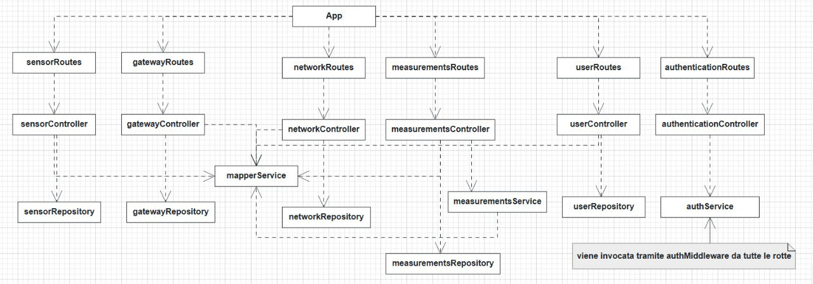
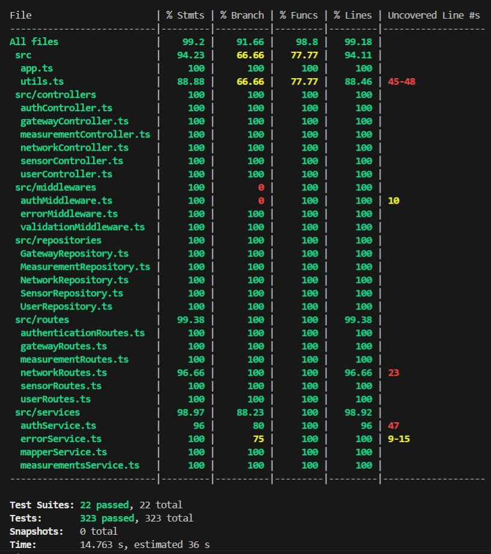

# Test Report

# Contents

- [Test Report](#test-report)
- [Contents](#contents)
- [Dependency graph](#dependency-graph)
- [Integration approach](#integration-approach)
    - [unit test](#unit-test)
      - [unit test repository](#unit-test-repository)
      - [unit test mesurement service](#unit-test-mesurement-service)
    - [integration test](#integration-test)
      - [integration test controller](#integration-test-controller)
      - [integration test routes](#integration-test-routes)
    - [e2e test](#e2e-test)
- [Tests](#tests)
- [Coverage](#coverage)
  - [Coverage of FR](#coverage-of-fr)
  - [Coverage white box](#coverage-white-box)

# Dependency graph

# Integration approach

  In generale l'approccio utilizzato è stato quello bottom up, considerando in maniera indipendente la logica per i sensori, gateway, network, misure,autenticazione e utenti.  
  Essendo la gestione delle misure non parallelizzabile come la gestione di network, gateway e sensori l'approccio è variato leggermente; abbiamo infatti dovuto includere test per branch coverage

  ### unit test 
  
  #### unit test repository
  - Utilizzando jest ed utilizzando mock per le dipendenze esterne è testata la logica vera e propria delle funzioni con approccio white box.   Il measurementRepository essendo più complicato è stato testato in modo più approfondito facnedo uso anche di branch coverage   per testare le logiche di funzionamento delle date, ad esempio
  #### unit test mesurement service
  - Essendo la logica di questo servizio una parte importante della logica dell'applicazione sono stati eseguiti degli unit test mirati a questo servizio.   Utilizzano mock per tutte le dipendenze e verificano con approccio black box/misto gli algoritmi di calcolo statistico
  
  ### integration test
  ####  integration test controller
  - Testano l'integrazione fra il controller layer, il mapping service Dto/Dao, il repository e un database (di test) vero e proprio.   Testano relazioni tra entità, vincoli di database e propagazione degli errori dal repository al controller
  #### integration test routes
  - Testano l'integrazione fra routes, middleware di autenticazione, validazione e di gestione errori.   Sono eseguiti usando jest e i mock, non ci sono vere interazioni col db, controller e servizio di autenticazione vengono simulati.   Verificano inoltre il parsing delle richeiste HTTP e la formattazione delle risposte agli errori
  ### e2e test
  - Test completo dell'intera applicazione compreso database e servizio http, nessun componente è simulato, si testa la compelta integrazione di tutti i layer.   Validano l'applicazione partendo dalla richiesta HTTP con generazione di token reali (e quindi la catena di autenticazione e autorizzazione)   fino ad arrivare, attraversando tutti gli strati dell'applicazione, alla scrittura e lettura da database
  

    

# Tests

| Test case name                                      | Object(s) tested                  | Test level     | Technique used          |
| :------------------------------------------------: | :-------------------------------: | :------------: | :---------------------: |
| **Unit Tests - Repositories**      |                                   |                |                         |
| Error handling (NotFound, Conflict)                | all repositories                  | Unit           | WB/statement coverage   |
| Create/read/readAll/update/delete   (CRUD)         | all repositories                  | Unit           | WB/statement coverage   |
| Validation logic                                   | all repositories                  | Unit           | WB/statement coverage   |
| Complex query logic (dates, hierarchies)           | measurement repositoy  | Unit           | WB/branch coverage/statement coverage  |
| **Unit Tests - Service Layer (measurements, auth)**                     |                |
| Measurement statistical calculations               | measurementService            | Unit         | BB/equivalence partitioning |
| Edge cases and measurement processing workflows    | measurementService              | Unit         | BB/boundary values      |
| **Integration Tests - Controller Layer**           |                                   |                |                           |
| Network/gateway/sensor controller integration    | network/gateway/sensorController + repository + DB   | Integration    | BB/equivalence partitioning |
| User controller integration                        | userController + repository         | Integration    | BB/equivalence partitioning |
| Measurement controller integration                 | measureController + repository + DB | Integration    | BB/equivalence partitioning |
| **Integration Tests - Routes Layer**               |                  |
| HTTP middleware chain integration                  | Routes + middleware (mocked controller) | Integration    | BB/equivalence partitioning |
| Authentication & authorization flow                | Routes + mocked auth service      | Integration    | BB/equivalence partitioning |
| Request validation & error formatting              | Routes + validation middleware    | Integration    | BB/boundary values      |
| CRUD operations                                    | Routes  (mocked controller)  | Integration    | BB/equivalence partitioning |
| **E2E Tests - Complete System**                    |                                   |                |                         |
| Authentication workflows (login, token validation) | complete Auth System              | e2e            | BB/equivalence partitioning |
| Authorization matrix (Admin/Operator/Viewer)       | Complete auth + all endpoints + Users   | E2E     | BB/equivalence partitioning |
| User management workflows                          | user API + database               | e2e            | BB/equivalence partitioning |
| Network, gateway, sensor management workflows      | network/gateway/sensor API + database | e2e            | BB/equivalence partitioning |
| Measurement complex workflows                      | measurement system + database | e2e            | BB/equivalence partitioning |
| Error scenarios (404, 409...) e edge cases         | complete system                   | e2e            | BB/error conditions     |
| Data persistence & entity relationships            | database + API                    | e2e            | BB/boundary values |

# Coverage

## Coverage of FR

<Report in the following table the coverage of functional requirements and scenarios(from official requirements) >

| Functional Requirement or scenario | Test(s)                                                                 | num      |
| :--------------------------------: | :---------------------------------------------------------------------: | :------: |
|                FR1.1               |  authentication 3 user types, token generation, wrong username o password  | 5 + n (tested indirectly in other e2e) 
|                FR2.1               | get all users, wrong token, unauthorized, insufficient rights    | 10 |
|                FR2.2               | create user, vari tipi, conflict error, unauthorized, insufficient rights, conflict error   | 9 |
|                FR2.3               | get user, not found, unauthorized, insufficient rights                  | 10 |
|                FR2.4               | delete user, not found, unauthorized, insufficient rights            | 9 |
| | |
|                FR3.1               | get all networks, insufficient rights, unauthorized | 10 |
|                FR3.2               | create network, insufficient rights, unauthorized, duplicated code, input validation, ignore nested gateways | 21 |
|                FR3.3               | get network, insufficient rights, unauthorized, non existing network (not found) | 12 |
|                FR3.4               | update network, insufficient rights, unauthorized, not found, iput validation, code already exists, ignore gateways| 22 |
|                FR3.5               | delete network, insufficient rights, unauthorized, not found | 14 |
| | |
|                FR4.1               | get all gateways in a network,  insufficient rights, unauthorized, invalid network | 8 |
|                FR4.2               | create gateway, insufficient rights, unauthorized, duplicated mac, input validation, ignore nested sensors, invalid network | 14 |
|                FR4.3               | get gateway, insufficient rights, unauthorized, not found, invalid network | 8 |
|                FR4.4               | update gateway, insufficient rights, unauthorized, not found, input validation, code already exists, ignore sensors| 16 |
|                FR4.5               | delete gateway, insufficient rights, unauthorized, not found, invalid network | 10 |
| | |
|                FR5.1               | get all sensors in a gateway, insufficient rights, unauthorized, invalid network/gateway | 12 |
|                FR5.2               | create sensor, insufficient rights, unauthorized, duplicated mac, input validation, invalid network/gateway | 16 |
|                FR5.3               | get sensor, insufficient rights, unauthorized, not found, invalid network/gateway   | 10 |
|                FR5.4               | update a sensor, insufficient rights, unauthorized, not found, input validation, code already exists | 18 |
|                FR5.5               | delete a sensor, insufficient rights, unauthorized, not found, invalid network/gateway | 13 |
| | |
|                FR6.1               | get measurements by network, insufficient rights, unauthorized, invalid network, date filtering, sensor filtering| 17 |
|                FR6.2               | get statistics (by network), insufficient rights, unauthorized, invalid network, stats calculation |  7  |
|                FR6.3               | get network outliers, insufficient rights, unauthorized, invalid network, date filtering, sensor filtering, outlier detection |  5 |
|                FR6.4               | store measurements, input validation, batch storage  | 7 |
|                FR6.5               | get measurements by sensor, invalid sensor, date filtering, empty sensor, edge cases                       | 15 |
|                FR6.6               | get sensor statistics,  date filtering, statistical calculations, no measurements  | 7 |
|                FR6.7               | get sensor outliers, date filtering, outlier detection, no measurements | 6 |

I test che rimangono fuori (ca. 12) riguardano l'infrastruttura del progetto, il setup o funzioni helper. Questi contrubuiscono solo indirettamente al testing dei requisiti funzionali.   Alcuni fra i test poi, sopratutto e2e, possono coprire più requisiti funzionali assieme, e quindi non è sempre possibile dividerli precisamente come appartenenti ad un singolo caso

## Coverage white box

La copertura risultante è praticamente completa (avg. 99.2 %), la statement coverage è sempre sopra l'88% e spesso completa.   Si può notare un calo di copertura nel file utils.ts nel quale non è stata testata la porzione della funzione parseStringArrayParam relativa alle stringhe, essendo i sensorMac sempre ricevuti in forma di Array di string.   Eventuali altre singole righe di codice scoperte sono di secondaria importanza e avrebbero richiesto test appositi prodotti solo per aumentare la percentuale di coverage senza un vero beneficio funzionale.

